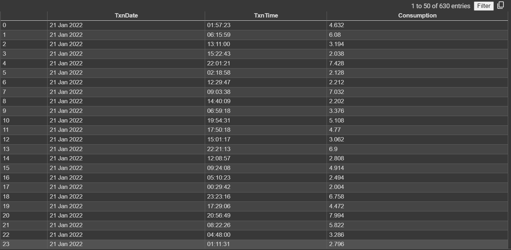
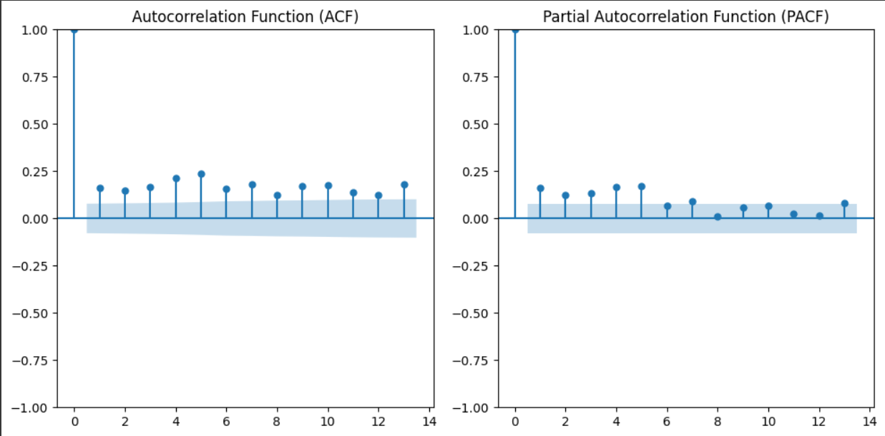
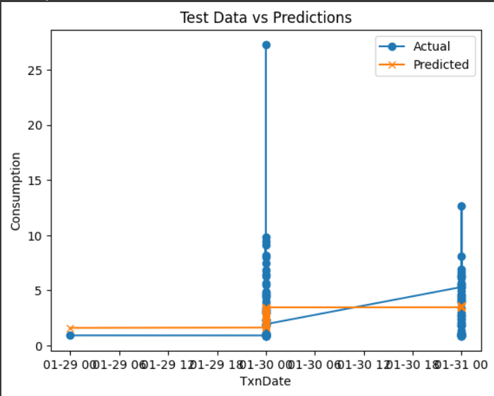

# Ex.No: 07                                       AUTO REGRESSIVE MODEL
### Date: 
### Developed By: Shaik Shoaib Nawaz
### Register No: 212222240094


### AIM:
To Implementat an Auto Regressive Model using Python
### ALGORITHM:
1. Import necessary libraries
2. Read the CSV file into a DataFrame
3. Perform Augmented Dickey-Fuller test
4. Split the data into training and testing sets.Fit an AutoRegressive (AR) model with 13 lags
5. Plot Partial Autocorrelation Function (PACF) and Autocorrelation Function (ACF)
6. Make predictions using the AR model.Compare the predictions with the test data
7. Calculate Mean Squared Error (MSE).Plot the test data and predictions.
### PROGRAM
```
# Import necessary libraries
import pandas as pd
import numpy as np
import matplotlib.pyplot as plt
from statsmodels.tsa.ar_model import AutoReg
from statsmodels.graphics.tsaplots import plot_pacf, plot_acf
from sklearn.metrics import mean_squared_error
from statsmodels.tsa.stattools import adfuller

# 1. Read the CSV file into a DataFrame
df = pd.read_csv('/content/KwhConsumptionBlower78_2.csv')  # Replace 'your_data.csv' with your actual file path
df.head()
# 2. Perform Augmented Dickey-Fuller test
df['TxnDate'] = pd.to_datetime(df['TxnDate'])
df.set_index('TxnDate', inplace=True)
result = adfuller(df['Consumption'])
print(f'ADF Statistic: {result[0]}')
print(f'p-value: {result[1]}')

# 3. Split the data into training and testing sets (80% train, 20% test)
train_size = int(len(df) * 0.8)
train, test = df['Consumption'][:train_size], df['Consumption'][train_size:]

# 4. Fit AutoRegressive model with 13 lags and plot PACF & ACF
model = AutoReg(train, lags=13)
model_fit = model.fit()

plt.figure(figsize=(10,5))
plt.subplot(121)
plot_acf(df['Consumption'], lags=13, ax=plt.gca())
plt.title('Autocorrelation Function (ACF)')
plt.subplot(122)
plot_pacf(df['Consumption'], lags=13, ax=plt.gca())
plt.title('Partial Autocorrelation Function (PACF)')
plt.tight_layout()
plt.show()

# 5. Make predictions using the AR model
predictions = model_fit.predict(start=len(train), end=len(train)+len(test)-1, dynamic=False)

# 6. Calculate Mean Squared Error (MSE) and plot results
mse = mean_squared_error(test, predictions)
print(f'Mean Squared Error: {mse}')

plt.plot(test.index, test, label='Actual', marker='o')
plt.plot(test.index, predictions, label='Predicted', marker='x')
plt.title('Test Data vs Predictions')
plt.xlabel('TxnDate')
plt.ylabel('Consumption')
plt.legend()
plt.show()
```
### OUTPUT:

#### GIVEN DATA:

#### ACF - PACF:


#### PREDICTION:



### RESULT:
Thus we have successfully implemented the auto regression function using python.
